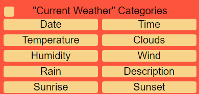

# Welcome to the 'Weather Project'! 
The 'Weather Project' is an application I have designed to showcase some of the skills I have developed in key areas like HTML, CSS, and JavaScript. The application allows a user to search and retrieve a specified location's weather data, as well as interact with how that information is displayed on screen. 
This project is a continued effort to learn and improve, so any and all feedback you may have would be greatly appreciated!

Table of Contents|
-
[Steps to running the application and tests](#run)|
[How to interact with the application](#interact)|
[App documentation](#docs)|
[Technologies used](#tools)|
[Developing the application](#build)|
[Future intentions](#future)|
[About me](#author)|

## Steps to running the application and tests: 	
1. Clone the repository into a local file
2. Install the dependencies > *npm install*
3. Run the application on a local host > *npm start*
4. Run the application tests > *npm test*

## How to interact with the application:
**Search bars**
There are two search bars that accept text input for specifying a location for weather data. For weather data to be retrieved the user is required to input into the 'City' search bar, while input into the 'Country' search bar is optional and allows for greater specificity. Both search bars automatically submit input after a 2 second wait from the last key press and do no require the user to enter or submit their input manually.

**Optional filters**
Clicking on the 'Optional filters' tab displays the optional filters that the user can use to interact with the tables below. Each beige coloured box  is an interactive button that represents that item being selected, with off-white coloured boxes representing the item being deselected. For example, clicking on a category item in '"Current Weather" Categories' selects or deselects that category from the "Current Weather" table below   Likewise, clicking on a day item in '8 Day Forecast" Days' selects or deselects that day from the "8 Day Forecast" table below. Finally, selecting the small button to the top left of each section selects or deselects all of the items for that section. 

**Table Buttons**
Clicking on the tabs above each table hides or displays the table below. 

**Tables**
Weather data is displayed in all three tables once a user enters an input into the 'City' search bar. However, if the user's input is invalid (i.e., there is no matching location in the database), then no content in the tables are displayed. 

**Responsive layout** 
All the elements displayed respond proportionately to the browser window being shortened and widened.

## App documentation:
(link to text file?)

## Technologies used:
**React** - Contains both the logic and HTML implementation of the application.
**Jest** - Used to unit test the logic within the various functions and components 
**SASS** - Used to format more clean, DRY, reusable CSS.

## Developing the application:
**What I learnt** 
I learnt a lot about JavaScript and React in developing this program. The 'debounce' implementation and testing local scoped functions gave me the opportunity to gain a more comprehensive understanding of closures and scope. Building the project with React also allowed me to learn about functional components and how to use React Hooks. Consistently refactoring my code also enabled me to explore some formatting conventions and discover more concise syntax shortcuts.

**What I enjoyed**
I really enjoyed problem solving when building, and being able to practically learn more about the different technologies that I hadn't previously had much experience with. 

**What I found difficult**
I found the planning and testing phases particularly challenging. I had intended to follow a Test Driven Development (TDD) approach, where I would write the test first and the actual component second. However, maybe due to my inexperience with the technologies I wasn't able to configure a clear outline for most features of the application, or how to build them in a progressive way. As I didn't know what components to build I wasn't able to follow a TDD process, which I think resulted in a more time consuming and intensive development build period.

**What I would like to improve next time**
Next time when working with the same technologies I would like to have a more strategic foundation when building logic and features. One way I could do this is to follow the Model, View, Controller, design more thoroughly.

## Future intentions:
**Integration testing**
Integration testing using the 'Cypress' framework is currently in developement to test that each user interaction causes the program to behave in the expected way.

**Design**
The current display design features 'hide element' features which can be disorientating to the user when element positioning drops in and out. A tab bar feature that contains a tab for each table could make the display more slim line and easier for the user to focus on only one element at a time. This would also feed into the 'Optional filters' where each section could be isolate towards its table and not lumped together. 

**Sort feature**
Another feature that could be added to further develop the program is a sorting function where the table data could be sorted by ascending or descending values.

## About me:
[Josh Keisler | LinkedIn](https://www.linkedin.com/in/josh-keisler-93b070a1/)
(link to CV)